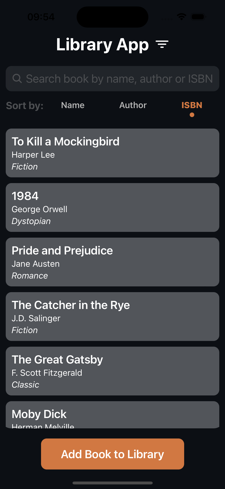
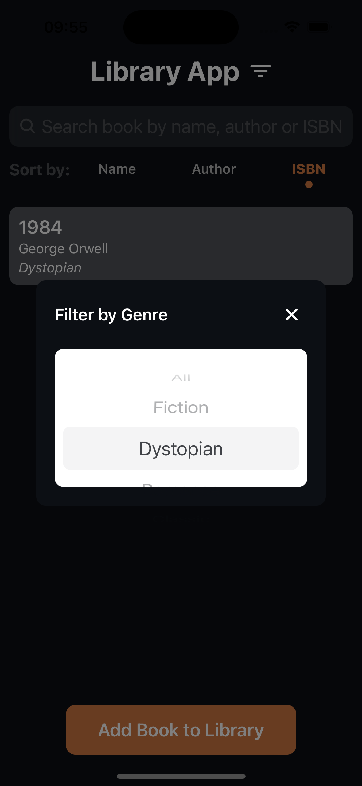
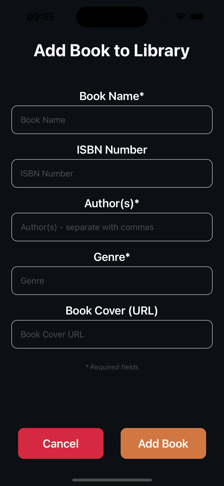

# Library App - Teknik Dokümantasyon

## 📋 Proje Özeti

Modern bir kütüphane yönetim uygulaması. React Native ve TypeScript kullanılarak geliştirilmiş, kişisel kitap koleksiyonlarını yönetmeyi amaçlayan bir mobil uygulama.

## 📱 Ekran Görüntüleri

### Ana Ekran



-   Kitap listesi görünümü
-   Arama ve filtreleme özellikleri
-   Sıralama seçenekleri

### Filtreleme



-   Modal tabanlı tür filtreleme
-   Dinamik tür listesi
-   Kolay seçim arayüzü

### Kitap Detayı


-   Detaylı kitap bilgileri
-   Kapak resmi görüntüleme
-   Silme ve düzenleme seçenekleri

### Kitap Ekleme



-   Kapsamlı form arayüzü
-   Zorunlu alan kontrolleri
-   Kullanıcı dostu tasarım

## 🛠 Teknik Seçimler ve Gerekçelendirmeler

### 1. Ana Teknoloji Seçimleri

#### React Native

-   **Neden?**: Cross-platform geliştirme imkanı
-   **Avantajlar**:
    -   Tek kod tabanı ile iOS ve Android desteği
    -   Geniş ekosistem ve topluluk desteği
    -   Native performans
    -   Hot Reloading ile hızlı geliştirme

#### TypeScript

-   **Neden?**: Tip güvenliği ve kod kalitesi
-   **Avantajlar**:
    -   Derleme zamanında hata yakalama
    -   Daha iyi IDE desteği
    -   Kod okunabilirliği ve bakım kolaylığı
    -   Interface ve type tanımları ile güvenli geliştirme

#### Redux Toolkit

-   **Neden?**: Merkezi state yönetimi
-   **Avantajlar**:
    -   Öngörülebilir state değişimleri
    -   DevTools ile debugging kolaylığı
    -   Immutable state yönetimi
    -   Boilerplate kod azaltımı
-   **Projede Kullanımı**:
    -   Kitap sıralama mantığının yönetimi
    -   Sıralama tercihlerinin global state'te tutulması
    -   Sıralama durumunun bileşenler arası senkronizasyonu

### 2. UI/UX Kararları

#### Modal Tabanlı Filtreleme

-   **Neden?**: Ekran alanını verimli kullanma
-   **Uygulama**: @react-native-picker/picker ile modal içinde tür seçimi
-   **Avantaj**: Kullanıcı deneyimini bozmadan fonksiyonellik sağlama

#### Koyu Tema

-   **Neden?**: Göz yorgunluğunu azaltma ve modern görünüm
-   **Uygulama**: Özel renk paleti (colors.js)
-   **Avantaj**: Tutarlı ve profesyonel görünüm

### 3. Veri Yönetimi

#### Yerel State Yönetimi

-   **Yapı**: books.js içinde array tabanlı veri saklama
-   **Avantaj**: Prototip geliştirme için hızlı çözüm
-   **Gelecek Geliştirme**: Backend entegrasyonu için hazır yapı

## 🚀 Kurulum Adımları

### 1. Gereksinimler

```bash
# Node.js (v14 veya üzeri)
node --version

# npm (v6 veya üzeri)
npm --version

# React Native CLI
npm install -g react-native-cli

# Xcode (iOS için, sadece macOS)
xcode-select --install

# Android Studio (Android için)
# https://developer.android.com/studio adresinden indirin
```

### 2. Proje Kurulumu

```bash
# Projeyi klonlayın
git clone https://github.com/merttcetn/LibraryApp
cd LibraryApp

# Bağımlılıkları yükleyin
npm install

# iOS için ek kurulum (sadece macOS)
cd ios
pod install
cd ..
```

### 3. Geliştirme Ortamı Ayarları

```bash
# .env dosyasını oluşturun (gerekirse)
cp .env.example .env

# Gerekli izinleri ayarlayın (Unix sistemlerde)
chmod +x android/gradlew
```

### 4. Uygulamayı Çalıştırma

```bash
# iOS Simulator için (sadece macOS)
npm run ios

# Android Emulator için
npm run android

# Metro bundler'ı başlatma
npm start
```

## 🔧 Proje Yapılandırması

### Dizin Yapısı ve Sorumluluklar

```
LibraryApp/
├── src/                    # Kaynak kodlar
│   ├── components/         # Yeniden kullanılabilir UI bileşenleri
│   ├── screens/           # Ekran bileşenleri
│   ├── features/          # Redux özellikleri
│   ├── navigation/        # Navigasyon yapılandırması
│   └── store.ts          # Redux store yapılandırması
└── assets/
    └── config/           # Yapılandırma dosyaları
```

### Önemli Yapılandırma Dosyaları

-   **babel.config.js**: Babel transpiler ayarları
-   **tsconfig.json**: TypeScript derleyici ayarları
-   **package.json**: Proje bağımlılıkları ve scriptler

## 📱 Geliştirme Kılavuzu

### Kod Standartları

-   ESLint ve Prettier kullanımı
-   TypeScript tip tanımları zorunluluğu
-   Component bazlı dosya organizasyonu

### State Yönetimi Prensipleri

-   Redux actions için tip tanımları
-   Immutable state güncellemeleri
-   Selector kullanımı

### Performans Optimizasyonları

-   React.memo kullanımı
-   useCallback ve useMemo optimizasyonları
-   Lazy loading uygulamaları

### 2. Redux İmplementasyonu

#### Sıralama Özelliği

-   **Store Yapısı**:
    ```typescript
    interface SortState {
        selectedSort: "name" | "author" | "isbn" | null;
    }
    ```
-   **Actions**:
    -   `setSort`: Sıralama kriterini günceller
    -   `clearSort`: Sıralama kriterini temizler

#### Neden Redux ile Sıralama?

1. **Merkezi Yönetim**:

    - Sıralama tercihi tüm uygulama genelinde tutarlı
    - Farklı ekranlar/bileşenler arasında senkronizasyon
    - Sıralama durumunun kalıcılığı

2. **Performans**:

    - Gereksiz yeniden render'ların önlenmesi
    - Memoization ile optimize edilmiş sıralama
    - Selector pattern kullanımı

3. **Bakım Kolaylığı**:
    - Sıralama mantığının tek bir yerde toplanması
    - Test edilebilirlik
    - Gelecek geliştirmelere uygunluk
