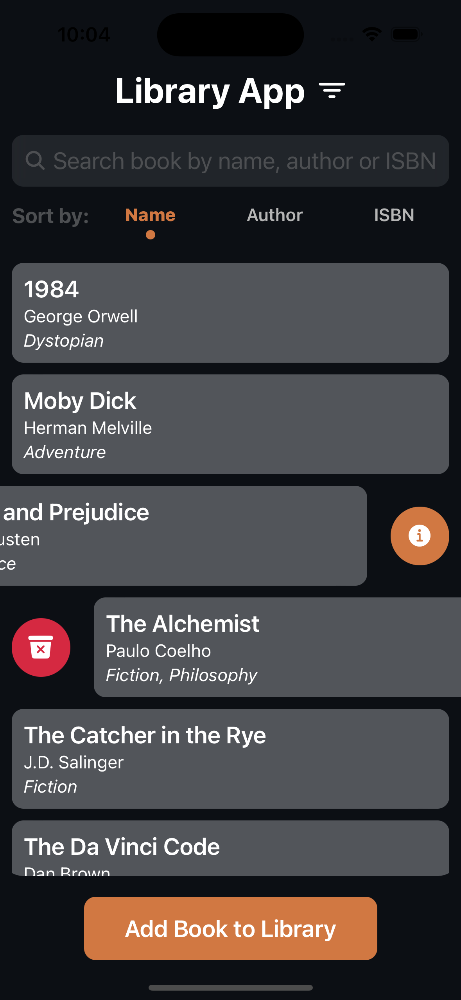

# Library App - Technical Documentation

## 📋 Project Overview

A modern library management application developed with React Native and TypeScript, designed to help users manage their personal book collections efficiently.

## 📱 Screenshots

### Home Screen



-   Book list view
-   Search and filtering capabilities
-   Sorting options

### Filtering


-   Modal-based genre filtering
-   Dynamic genre list
-   Easy selection interface

### Book Details


-   Detailed book information
-   Cover image display
-   Delete and edit options

### Add Book


-   Comprehensive form interface
-   Required field validation
-   User-friendly design

## 🛠 Technical Choices and Rationale

### 1. Core Technology Choices

#### React Native

-   **Why?**: Cross-platform development capability
-   **Benefits**:
    -   Single codebase for iOS and Android
    -   Extensive ecosystem and community support
    -   Native performance
    -   Rapid development with Hot Reloading

#### TypeScript

-   **Why?**: Type safety and code quality
-   **Benefits**:
    -   Compile-time error detection
    -   Enhanced IDE support
    -   Better code readability and maintainability
    -   Safe development with interfaces and type definitions

#### Redux Toolkit

-   **Why?**: Centralized state management
-   **Benefits**:
    -   Predictable state changes
    -   Debugging with DevTools
    -   Immutable state management
    -   Reduced boilerplate code
-   **Implementation in Project**:
    -   Book sorting logic management
    -   Global sorting preferences
    -   Cross-component state synchronization

### 2. UI/UX Decisions

#### Modal-Based Filtering

-   **Why?**: Efficient screen space utilization
-   **Implementation**: Genre selection using @react-native-picker/picker in modal
-   **Benefit**: Enhanced functionality without compromising UX

#### Dark Theme

-   **Why?**: Reduced eye strain and modern appearance
-   **Implementation**: Custom color palette (colors.js)
-   **Benefit**: Consistent and professional look

### 3. Data Management

#### Local State Management

-   **Structure**: Array-based data storage in books.js
-   **Benefit**: Quick solution for prototype development
-   **Future Development**: Ready for backend integration

## 🚀 Setup Instructions

### 1. Prerequisites

```bash
# Node.js (v14 or higher)
node --version

# npm (v6 or higher)
npm --version

# React Native CLI
npm install -g react-native-cli

# Xcode (for iOS, macOS only)
xcode-select --install

# Android Studio (for Android)
# Download from https://developer.android.com/studio
```

### 2. Project Setup

```bash
# Clone the repository
git clone https://github.com/merttcetn/LibraryApp
cd LibraryApp

# Install dependencies
npm install

# iOS additional setup (macOS only)
cd ios
pod install
cd ..
```

### 3. Development Environment Setup

```bash
# Create .env file (if needed)
cp .env.example .env

# Set permissions (Unix systems)
chmod +x android/gradlew
```

### 4. Running the Application

```bash
# For iOS Simulator (macOS only)
npm run ios

# For Android Emulator
npm run android

# Start Metro bundler
npm start
```

## 🔧 Project Configuration

### Directory Structure and Responsibilities

```
LibraryApp/
├── src/                    # Source code
│   ├── components/         # Reusable UI components
│   ├── screens/           # Screen components
│   ├── features/          # Redux features
│   ├── navigation/        # Navigation configuration
│   └── store.ts          # Redux store configuration
└── assets/
    └── config/           # Configuration files
```

### Key Configuration Files

-   **babel.config.js**: Babel transpiler settings
-   **tsconfig.json**: TypeScript compiler configuration
-   **package.json**: Project dependencies and scripts

## 📱 Development Guide

### Code Standards

-   ESLint and Prettier usage
-   TypeScript type definitions requirement
-   Component-based file organization

### State Management Principles

-   Type definitions for Redux actions
-   Immutable state updates
-   Selector pattern usage

### Performance Optimizations

-   React.memo implementation
-   useCallback and useMemo optimizations
-   Lazy loading implementations

### Redux Implementation

#### Sorting Feature

```typescript
interface SortState {
    selectedSort: "name" | "author" | "isbn" | null;
}
```

#### Actions

-   `setSort`: Updates sorting criterion
-   `clearSort`: Clears sorting criterion

#### Why Redux for Sorting?

1. **Centralized Management**:

    - Consistent sorting preferences across the app
    - Synchronization between screens/components
    - Persistence of sorting state

2. **Performance**:

    - Prevention of unnecessary re-renders
    - Optimized sorting with memoization
    - Selector pattern implementation

3. **Maintainability**:
    - Centralized sorting logic
    - Testability
    - Ready for future enhancements

## 🔄 Future Developments

1. Backend Integration

    - RESTful API implementation
    - Real-time updates support

2. Offline Usage

    - AsyncStorage implementation
    - Offline-first approach

3. Testing Coverage
    - Unit tests
    - Integration tests
    - E2E tests

## 📚 Additional Resources

-   [React Native Documentation](https://reactnative.dev/docs/getting-started)
-   [TypeScript Documentation](https://www.typescriptlang.org/docs/)
-   [Redux Toolkit Guide](https://redux-toolkit.js.org/introduction/getting-started)
